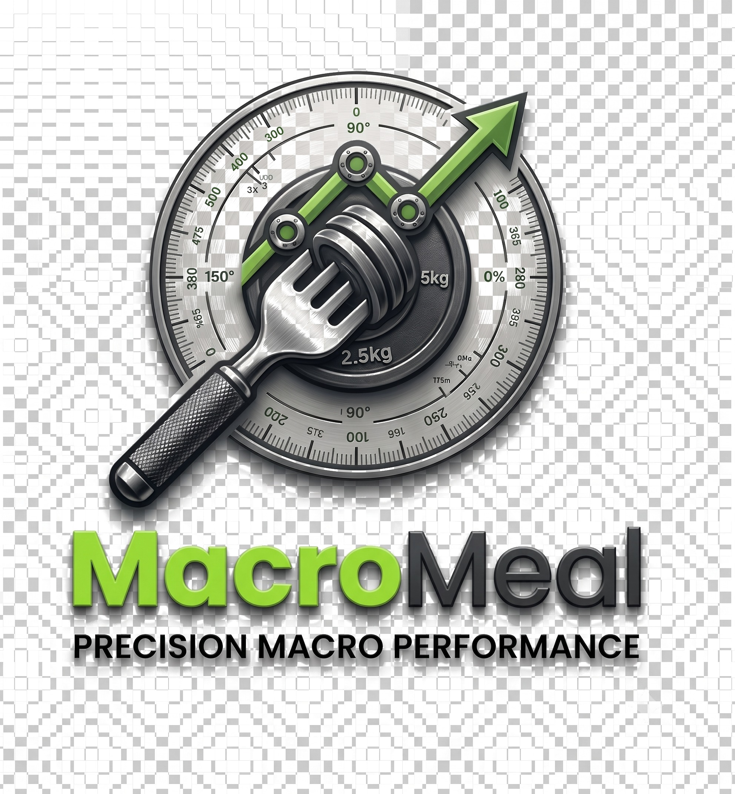
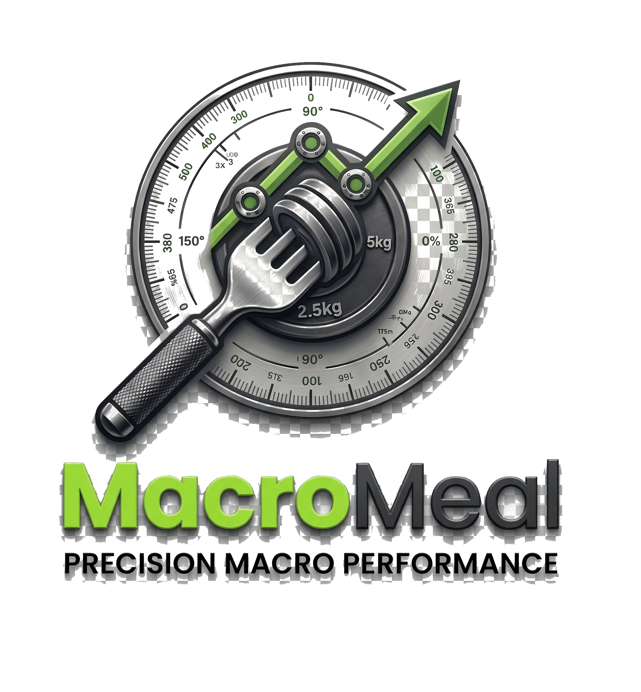
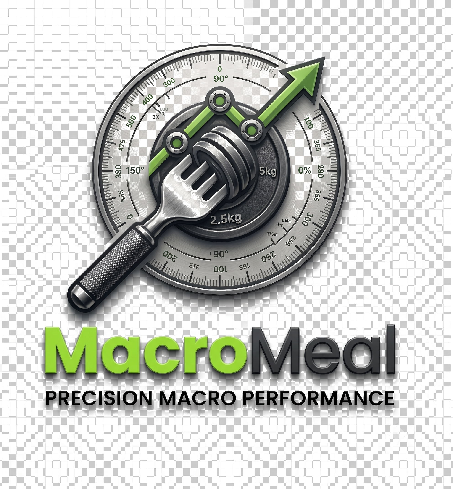

# MacroMeal

MacroMeal is a simple web-based nutrition planner that helps you build meals around your calorie and macro targets.

Instead of manually trying different food combinations, you enter your target calories, protein, carbs, fats and fiber, and the app searches through the available foods to find combinations that are close to your requirements.

## App Preview

<p align="center">
  
</p>

<p align="center">
  
  
</p>

These visuals show the brand direction and the app's nutrition-focused identity, giving a quick sense of the project before you explore the features and functionality.

## What it does

* Calculates estimated daily calorie and macro targets
* Generates meal suggestions based on calorie and macro requirements
* Supports vegetarian and non-vegetarian meal plans
* Searches and filters the food database
* Shows nutrition values per 100g
* Saves favorite meals
* Keeps a daily meal log
* Allows admins to add custom food items
* Stores user-added data locally in the browser

The meal planner uses a combinatorial search approach and ranks combinations based on how closely they match the requested targets. The current matching logic uses a ±5% calorie tolerance and ±10% macro tolerance.

## Features

### Calorie Calculator

Enter your height, weight, activity level, number of meals and goal to get an estimated daily calorie target.

Supported goals:

* Fat loss
* Muscle build
* Maintenance
* Weight gain

The calculator is intended as a planning tool, not as medical advice.

### Macro Meal Planner

You can directly enter:

* Calories
* Protein
* Carbohydrates
* Fat
* Fiber

MacroMeal then searches the food database and returns the closest meal combinations.

Each suggestion shows the foods, quantities and total nutritional values. You can either save the meal or add it to your daily log.

### Food Database

The database contains foods grouped into categories such as:

* Protein
* Carbs
* Fat
* Dairy
* Vegetables

You can search by food name and filter the results by diet type or category.

### Favorites

Found a meal that works for you?

Save it to Favorites and access it later without generating it again.

Favorites are stored using the browser's `localStorage`.

### Daily Log

Meals can be added to the daily log directly from the meal suggestions. The log is maintained locally in the browser, so there is no account database behind it.

### Admin Mode

The project also has a small admin workspace where food items can be added to the database.

Custom foods are saved locally and become available to the meal planner immediately.

## Tech Stack

* HTML5
* CSS3
* JavaScript
* JSON
* Browser LocalStorage
* Google Fonts

There is no backend server in the current version. Food data is loaded from `data/foods.json`, while custom foods, favorites and logs are stored in the browser.

## Project Structure

```text
MacroMeal/
│
├── index.html
├── style.css
├── script.js
│
├── data/
│   └── foods.json
│
├── assets/
│   └── macromeal-logo.png
│
└── README.md
```

## How the meal matching works

The planner creates possible combinations of foods using predefined serving sizes.

For every combination, it calculates:

* Calories
* Protein
* Carbohydrates
* Fat
* Fiber

It then compares those values with the user's targets and assigns a match score.

Protein, carbs and fat have more influence on the score than calories and fiber, which helps the planner prioritize the actual macro requirements rather than only trying to hit the calorie number.

The planner finally displays the best matching combinations instead of returning every possible combination.

## Running the project

Since the app loads the food database using `fetch()`, it should be opened through a local server rather than directly opening the HTML file.

### Option 1 — VS Code Live Server

1. Clone the repository.
2. Open the project in VS Code.
3. Install the Live Server extension.
4. Right-click `index.html`.
5. Select **Open with Live Server**.

### Option 2 — Python

If Python is installed:

```bash
python -m http.server 8000
```

Then open:

```text
http://localhost:8000
```

## Demo Admin Login

The current project includes a demo admin login:

```text
Username: admin
Password: admin123
```

This is only a frontend demo login and should not be treated as real authentication.

## Data Storage

MacroMeal currently uses two sources of data:

**Food database**

```text
data/foods.json
```

**Browser storage**

Used for things such as:

* Custom food items
* Deleted food IDs
* Favorite meals
* Daily meal logs

This means the saved data belongs to the browser/device being used and is not synchronized between different devices.

## Current Limitations

This is a frontend project, so there are a few limitations:

* No real user authentication
* No backend/database
* User data is stored locally
* Admin credentials are hardcoded for demonstration
* Nutrition calculations are estimates
* Meal combinations depend on the available food dataset

These are areas that could be improved in a future version.

## Possible Improvements

Some things I would like to add later:

* Backend with a proper database
* Real user accounts
* Cloud-synced meal history
* Better meal recommendation logic
* More detailed nutrition information
* Weekly meal planning
* Shopping list generation
* Custom calorie and macro presets
* Mobile-first improvements
* Nutrition API integration

## Why I built this

I wanted to build something that was more useful than a basic calorie calculator.

The main idea was to take the numbers a person already knows — calories and macros — and work backwards to find actual food combinations that fit those numbers.

That turned the project into more of a search and optimization problem instead of just a collection of forms and calculations.

## Disclaimer

MacroMeal is intended for general nutrition planning and educational purposes. The calorie and macro recommendations are estimates and should not be considered medical or dietary advice.

## Author
**Akash Anand**
**Bhavya Singla**
**Aayush Madan**

Built as a personal/student project while exploring frontend development, JavaScript logic and nutrition-based recommendation systems.
